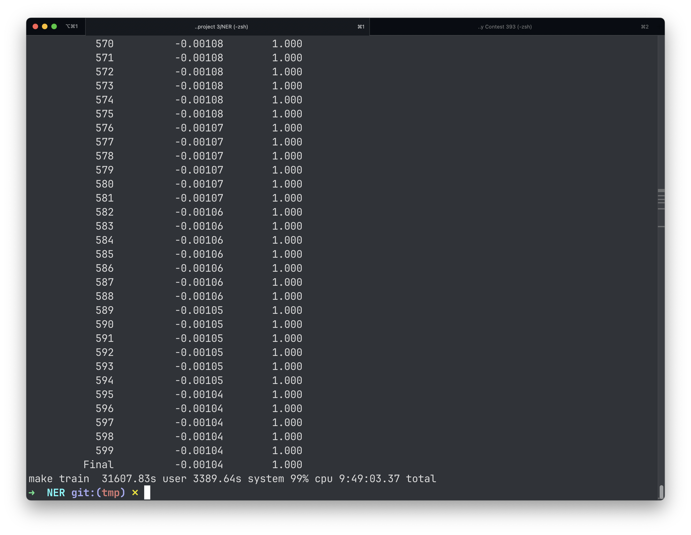

# MEP

This is CISC3025 NLP project 3, which about implement name entity using maximum entropy model.

# 600-iters, but unfortnitely deleted .....

   
# Makefile

use `make` to run to program in path: `MEP/CISC3025 project 3/NER`

```shell
make t
```

This is eqivalent to `python3 run.py -t`

```shell
make d
```

```shell
make s
```

```shell
make D
```

This is new command which is eqivalent to `python3 run.py -D`. It shows the samples that with wrong judgement and 
count the number of such samples
